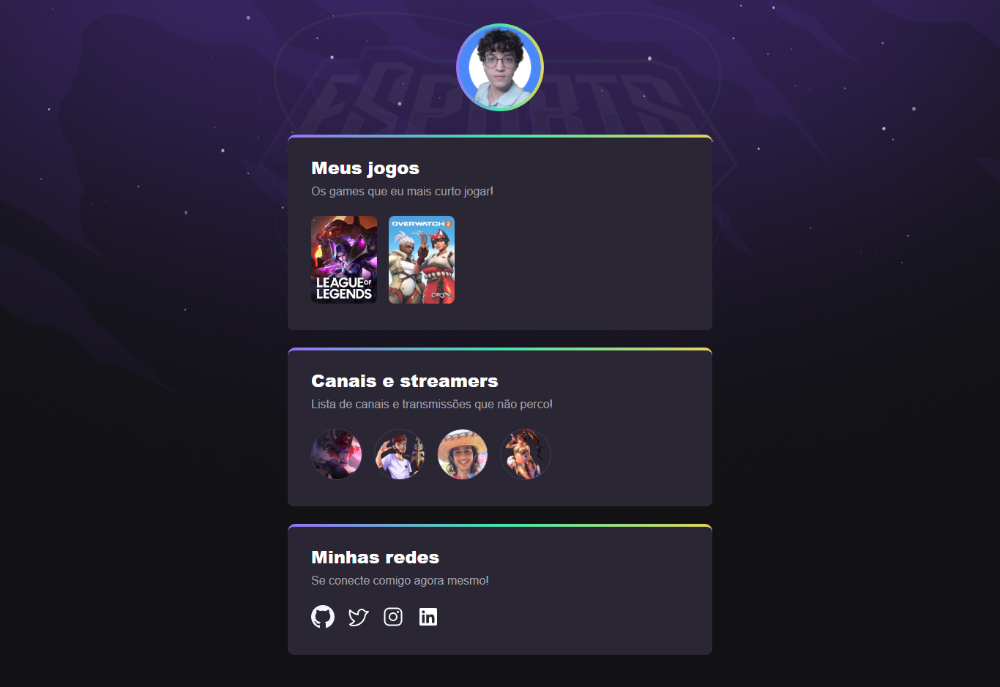

<h1 align="center"> NLW eSports • Refatoração com ReactJS</h1>

Meu primeiro projeto utilizando a biblioteca ReactJS.

 

  

## 🚀 Tecnologias

Esse projeto foi desenvolvido com as seguintes tecnologias:

- React
- Vite

## 💻 Projeto

Refatoração de um [projeto](https://github.com/edusmpaio/nlw-esports) realizado durante o evento NLW eSports, da Rocketseat, utilizando React.
Consiste em uma página de links voltada para o mundo dos games.

🔗 [Clique aqui](https://nlw-esports-react-eight.vercel.app/) para acessar o deploy.
